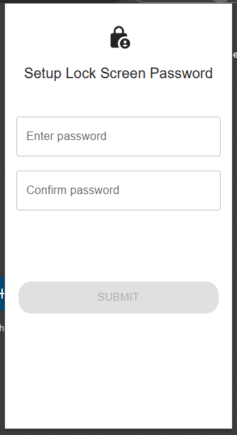

# XAuth

[](https://github.com/15ho/xauth/actions?query=workflow%3ATest)
[](https://codecov.io/gh/15ho/xauth)

A Chrome extension for generating TOTP codes.



base on:
- [React](https://reactjs.org/)
- [Vite](https://vitejs.dev/)
- [CRXJS](https://crxjs.dev/vite-plugin)
- [Material UI](https://mui.com/material-ui/)
- [OTPAuth](https://github.com/hectorm/otpauth)
- [jsQR](https://github.com/cozmo/jsQR)
- [crypto-js](https://github.com/brix/crypto-js)

## Development
```shell
npm install
npm run dev # hot reload
# generate "dist" directory

# --- Install xauth extension in chrome ---
# 1. Chrome open link: chrome://extensions/
# 2. Enable developer mode
# 3. Click "Load unpacked" (Select the "dist" directory)
```

## Release
```shell
npm run build # generate "release" directory
# crx-XAuth-1.0.0.zip
```